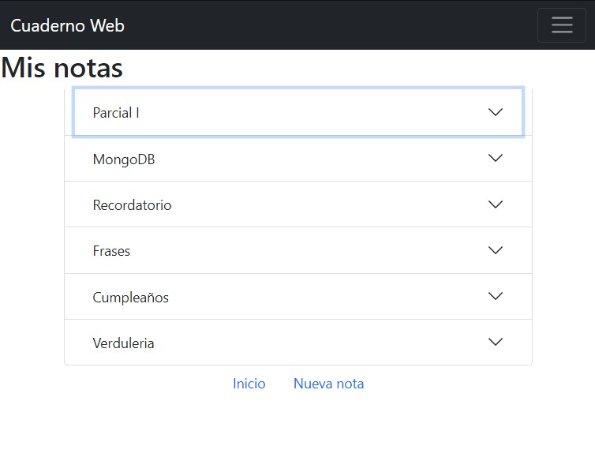

# Cuaderno web de notas

Cuaderno web es una aplicación minimalista para crear y guardar notas en una base de datos a través del navegador.

Esta aplicación es desarrollada con las siguietes herramientas:
- Node.js
- Express
- EJS
- MongoDB

